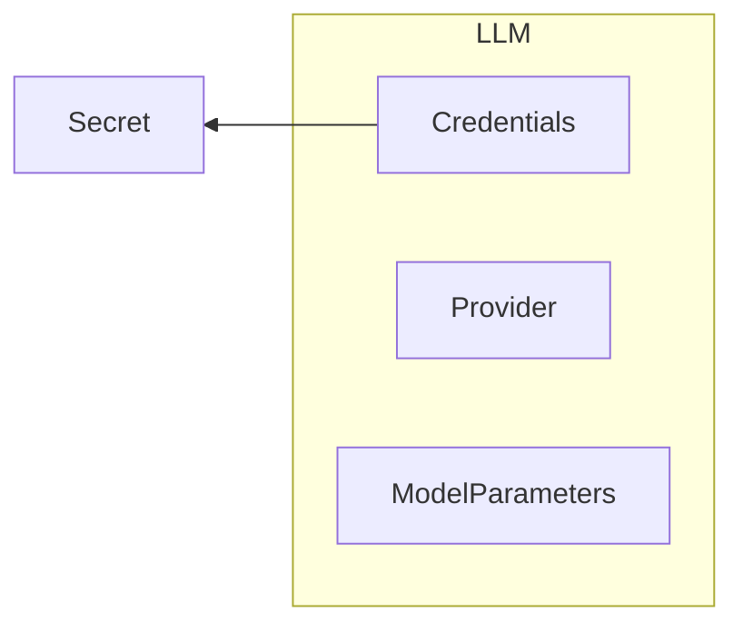
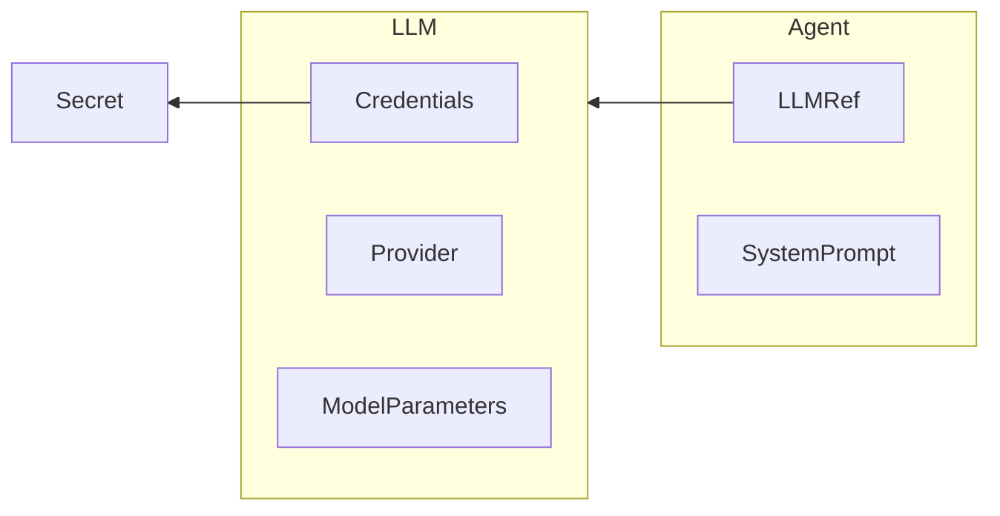
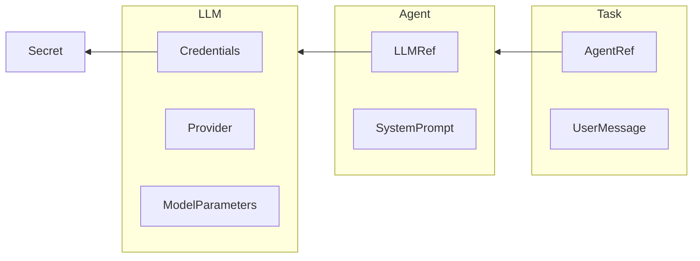
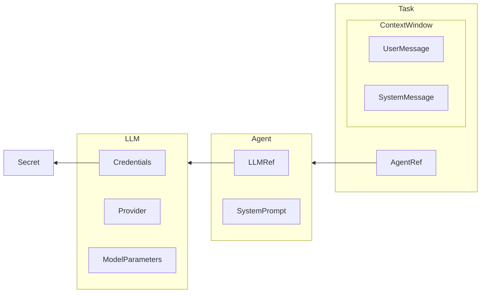
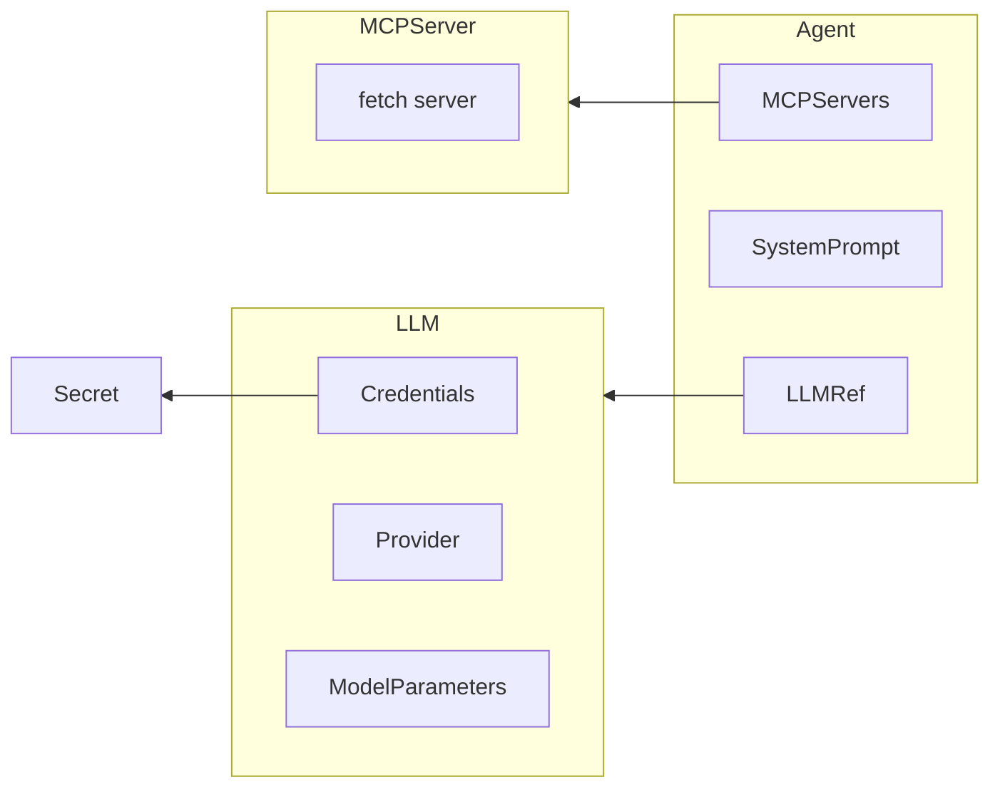
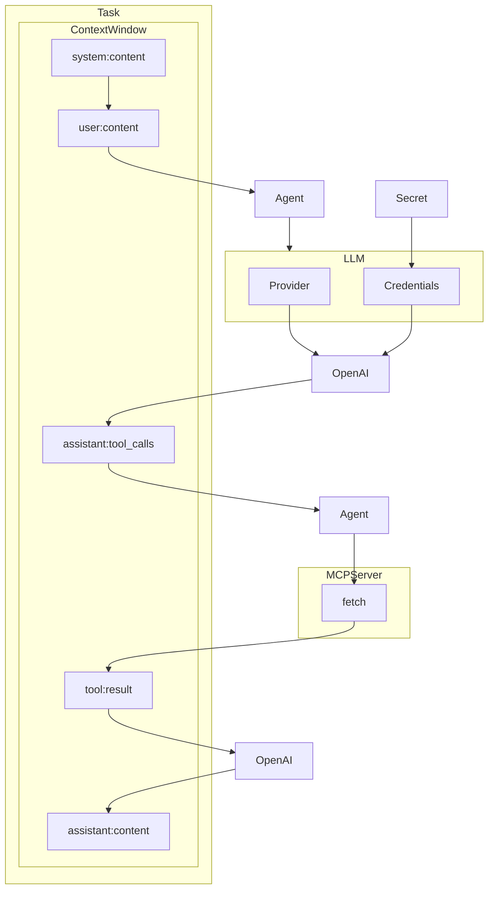

<div align="center">

<h1>Agent Control Plane (ACP)</h1>

</div>

ACP (Agent Control Plane) is a cloud-native orchestrator for AI Agents built on Kubernetes. It supports [long-lived outer-loop agents](https://theouterloop.substack.com/p/openais-realtime-api-is-a-step-towards) that can process asynchronous execution of both LLM inference and long-running tool calls. It's designed for simplicity and gives strong durability and reliability guarantees. It embraces concepts from [12-factor-agents](https://hlyr.dev/12fa) for agents that make asynchronous tool calls like contacting humans or delegating work to other agents.

:warning: **Note** - ACP is in alpha.

<div align="center">

<h3>

[Discord](https://humanlayer.dev/discord) | [Documentation](./docs) | [Examples](./acp-example) 

</h3>

[](https://github.com/humanlayer/agentcontrolplane) 
[](https://opensource.org/licenses/Apache-2)

</div>

## Table of Contents

- [Key Features](#key-features)
- [Architecture](#architecture)
  - [Core Objects](#core-objects)
- [Getting Started](#getting-started)
  - [Prerequisites](#prerequisites)
  - [Setting Up a Local Cluster](#setting-up-a-local-cluster)
  - [Deploying ACP](#deploying-acp) 
  - [Creating an Agent and Running your first task](#creating-an-agent-and-running-your-first-task)
  - [Adding Tools with MCP](#adding-tools-with-mcp)
  - [Using other language models](#using-other-language-models)
  - [Incorporating Human Approval](#incorporating-human-approval)
  - [Incorporating Humans as Tools](#humans-as-tools)
  - [Cleaning Up](#cleaning-up)
- [Design Principles](#design-principles)
- [Contributing](#contributing)
- [License](#license)


## Architecture


### Core Objects

- **LLM**: Provider + API Keys + Parameters
- **Agent**: LLM + System Prompt + Tools
- **Tools**: MCP Servers, Humans, Other Agents
- **Task**: Agent + User Message + Current context window
- **ToolCall**: A single tool call that occurred during a Task

## Getting Started

### Prerequisites

To run ACP, you'll need: 

- **kubectl** - Command-line tool for Kubernetes `brew install kubectl`
- **OpenAI API Key** - For LLM functionality https://platform.openai.com

To run ACP locally on macos, you'll also need: 

- **kind** - For running local Kubernetes clusters `brew install kind` (other cluster options should work too)
- **Docker** - For building and running container images `brew install --cask docker`

### Setting Up a Local Cluster

```bash
kind create cluster
```

### Add your OpenAI API key as a Kubernetes secret

For Anthropic and other providers, see [Using other language models](#using-other-language-models)

```bash
kubectl create secret generic openai \
  --from-literal=OPENAI_API_KEY=$OPENAI_API_KEY \
  --namespace=default
```

### Deploying ACP 


> [!TIP]
> For better visibility when running tutorial, we recommend starting
> a stream to watch all the events as they're happening,
> for example:
>
> ```bash
> kubectl get events --watch
> ```

Deploy the ACP operator to your cluster:

```bash
kubectl apply -f https://raw.githubusercontent.com/humanlayer/agentcontrolplane/refs/heads/main/acp/config/release/latest.yaml
```

<details>
<summary>Just the CRDs</summary>

```bash
kubectl apply -f https://raw.githubusercontent.com/humanlayer/agentcontrolplane/refs/heads/main/acp/config/release/latest-crd.yaml
```

</details>

<details>
<summary>Install a specific version</summary>

```bash
kubectl apply -f https://raw.githubusercontent.com/humanlayer/agentcontrolplane/refs/heads/main/acp/config/release/v0.1.0.yaml
```

</details>

This command will build the operator, create necessary CRDs, and deploy the ACP components to your cluster. <!-- Updated Name -->

### Creating Your First Agent and Running your first task

1. **Define an LLM resource**

```bash
cat <<EOF | kubectl apply -f -
apiVersion: acp.humanlayer.dev/v1alpha1  
kind: LLM
metadata:
  name: gpt-4o
spec:
  provider: openai
  parameters:
    model: gpt-4o
  apiKeyFrom:
    secretKeyRef:
      name: openai
      key: OPENAI_API_KEY
EOF
```



Check the created LLM:

```bash
kubectl get llm
```

   Output:
```
NAME     PROVIDER   READY   STATUS
gpt-4o   openai     true    Ready
```

<details>
<summary>Using `-o wide` and `describe`</summary>

```bash
kubectl get llm -o wide
```

   Output:
```
NAME     PROVIDER   READY   STATUS   DETAIL
gpt-4o   openai     true    Ready    OpenAI API key validated successfully
```

```bash
kubectl describe llm gpt-4o
```

Output:

```
Name:         gpt-4o
Namespace:    default
Labels:       <none>
Annotations:  <none>
API Version:  acp.humanlayer.dev/acp
Kind:         LLM
Metadata:
  Creation Timestamp:  2025-03-21T20:18:17Z
  Generation:          2
  Resource Version:    1682222
  UID:                 973098fb-2b8d-46b3-be49-81592e0b8f4e
Spec:
  API Key From:
    Secret Key Ref:
      Key:   OPENAI_API_KEY
      Name:  openai
  Provider:  openai
  Parameters: 
    Model: gpt-4o
Status:
  Ready:          true
  Status:         Ready
  Status Detail:  OpenAI API key validated successfully
Events:
  Type    Reason               Age                 From            Message
  ----    ------               ----                ----            -------
  Normal  ValidationSucceeded  32m (x3 over 136m)  llm-controller  OpenAI API key validated successfully
```

</details>

2. **Create an Agent resource**

```bash
cat <<EOF | kubectl apply -f -
apiVersion: acp.humanlayer.dev/v1alpha1 
kind: Agent
metadata:
  name: my-assistant
spec:
  llmRef:
    name: gpt-4o
  system: |
    You are a helpful assistant. Your job is to help the user with their tasks.
EOF
```



   Check the created Agent:

```bash
kubectl get agent
```

   Output:
```
NAME           READY   STATUS
my-assistant   true    Ready
```

<details>
<summary>Using `-o wide` and `describe`</summary>

```bash
kubectl get agent -o wide
```

   Output:
```
NAME           READY   STATUS   DETAIL
my-assistant   true    Ready    All dependencies validated successfully
```

```bash
kubectl describe agent my-assistant 
```

Output:

```
Name:         my-assistant
Namespace:    default
Labels:       <none>
Annotations:  <none>
API Version:  acp.humanlayer.dev/acp
Kind:         Agent
Metadata:
  Creation Timestamp:  2025-03-21T22:06:27Z
  Generation:          1
  Resource Version:    1682754
  UID:                 e389b3e5-c718-4abd-aa72-d4fc82c9b992
Spec:
  Llm Ref:
    Name:  gpt-4o
  System:  You are a helpful assistant. Your job is to help the user with their tasks.

Status:
  Ready:          true
  Status:         Ready
  Status Detail:  All dependencies validated successfully
Events:
  Type    Reason               Age                From              Message
  ----    ------               ----               ----              -------
  Normal  Initializing         64m                agent-controller  Starting validation
  Normal  ValidationSucceeded  64m (x2 over 64m)  agent-controller  All dependencies validated successfully
```

</details>

#### Running Your First Task
Create a Task to interact with your agent:


```bash
cat <<EOF | kubectl apply -f -
apiVersion: acp.humanlayer.dev/v1alpha1 
kind: Task
metadata:
  name: hello-world-1
spec:
  agentRef:
    name: my-assistant
  userMessage: "What is the capital of the moon?"
EOF
```


Check the created Task:

```bash
kubectl get task
```

   Output:

```
NAME            READY   STATUS   PHASE         PREVIEW                            OUTPUT
hello-world-1   true    Ready    FinalAnswer   What is the capital of the moon?   The Moon does not have a capital. It is a natural satellite of Earth and does not have any political or administrative divisions like a country does. There are no permanent human settlements on the Moon, so it does not have a capital city.
```

You can describe the task to see the full context window

```bash
kubectl describe task hello-world-1
```

Output:

```
# ...snip...
Status:
  Context Window:
    Content:  You are a helpful assistant. Your job is to help the user with their tasks.

    Role:     system
    Content:  What is the capital of the moon?
    Role:     user
    Content:  The Moon does not have a capital, as it is not a governed entity like a country. It is a natural satellite of Earth. However, if you are referring to human activity on the Moon, there is no permanent settlement or colony established there as of now. Most activities on the Moon have been in the form of missions or landings conducted by various space agencies.
    Role:     assistant

# ...snip...

  Status Detail:  LLM final response received
Events:
  Type    Reason                     Age   From             Message
  ----    ------                     ----  ----             -------
  Normal  ValidationSucceeded        65s   task-controller  Task validation succeeded
  Normal  SendingContextWindowToLLM  65s   task-controller  Sending context window to LLM
  Normal  LLMFinalAnswer             64s   task-controller  LLM response received successfully

```

</details>

The Task object stores and manages the context window of a agent conversation loop.



To get just the output, run

```bash
kubectl get task hello-world-1 -o jsonpath='{.status.output}' 
```

and you'll see


> The Moon does not have a capital. It is a natural satellite of Earth and lacks any governmental structure or human habitation that would necessitate a capital city.

you can also use `get -o yaml` to see the full context window in a slightly more readable format (but without the events)

```bash
kubectl get task hello-world-1 -o yaml
```

<details>
<summary>Output (truncated for brevity)</summary>

```
apiVersion: v1
items:
- apiVersion: acp.humanlayer.dev/v1alpha1 
  kind: Task
  metadata:
    annotations:
      kubectl.kubernetes.io/last-applied-configuration: |
        {"apiVersion: acp.humanlayer.dev/v1alpha1 ","kind":"Task","metadata":{"annotations":{},"name":"hello-world-1","namespace":"default"},"spec":{"agentRef":{"name":"my-assistant"},"userMessage":"What is the capital of the moon?"}}
    creationTimestamp: "2025-04-05T01:04:15Z"
    generation: 1
    name: hello-world-1
    namespace: default
    resourceVersion: "3190"
    uid: 673a780e-1234-4a7d-9ace-68f49d7f2061
  spec:
    agentRef:
      name: my-assistant
    userMessage: What is the capital of the moon?
  status:
    contextWindow:
    - content: |
        You are a helpful assistant. Your job is to help the user with their tasks.
      role: system
    - content: What is the capital of the moon?
      role: user
    - content: The Moon does not have a capital, as it is not a governed entity like
        a country. It is a natural satellite of Earth. However, if you are referring
        to human activity on the Moon, there is no permanent settlement or colony
        established there as of now. Most activities on the Moon have been in the
        form of missions or landings conducted by various space agencies.
      role: assistant
    output: The Moon does not have a capital, as it is not a governed entity like
      a country. It is a natural satellite of Earth. However, if you are referring
      to human activity on the Moon, there is no permanent settlement or colony established
      there as of now. Most activities on the Moon have been in the form of missions
      or landings conducted by various space agencies.
    phase: FinalAnswer
    ready: true
    spanContext:
      spanID: 648ca5bf05d0ec05
      traceID: d3fb4171016bcab77d63b02e52e006cd
    status: Ready
    statusDetail: LLM final response received
kind: List
metadata:
  resourceVersion: ""

```
</details>

### Adding Tools with MCP

Agent's aren't that interesting without tools. Let's add a basic MCP server tool to our agent:

```bash
cat <<EOF | kubectl apply -f -
apiVersion: acp.humanlayer.dev/v1alpha1 
kind: MCPServer
metadata:
  name: fetch
spec:
  transport: "stdio"
  command: "uvx"
  args: ["mcp-server-fetch"]
EOF
```

```bash
kubectl get mcpserver
```

```
NAME     READY   STATUS
fetch    true    Ready
```

```bash
kubectl describe mcpserver
```
Output:


```
# ...snip...

Status:
  Connected:      true
  Status:         Ready
  Status Detail:  Connected successfully with 1 tools
  Tools:
    Description:  Fetches a URL from the internet and optionally extracts its contents as markdown.

Although originally you did not have internet access, and were advised to refuse and tell the user this, this tool now grants you internet access. Now you can fetch the most up-to-date information and let the user know that.
    Input Schema:
      Properties:
        max_length:
          Default:            5000
          Description:        Maximum number of characters to return.
          Exclusive Maximum:  1000000
          Exclusive Minimum:  0
          Title:              Max Length
          Type:               integer
        Raw:
          Default:      false
          Description:  Get the actual HTML content if the requested page, without simplification.
          Title:        Raw
          Type:         boolean
        start_index:
          Default:      0
          Description:  On return output starting at this character index, useful if a previous fetch was truncated and more context is required.
          Minimum:      0
          Title:        Start Index
          Type:         integer
        URL:
          Description:  URL to fetch
          Format:       uri
          Min Length:   1
          Title:        Url
          Type:         string
      Required:
        url
      Type:  object
    Name:    fetch
Events:
  Type    Reason     Age                  From                  Message
  ----    ------     ----                 ----                  -------
  Normal  Connected  3m14s (x8 over 63m)  mcpserver-controller  MCP server connected successfully
```

Then we can update our agent in-place to give it access to the fetch tool:

```bash
cat <<EOF | kubectl apply -f -
apiVersion: acp.humanlayer.dev/v1alpha1 
kind: Agent
metadata:
  name: my-assistant
spec:
  llmRef:
    name: gpt-4o
  system: |
    You are a helpful assistant. Your job is to help the user with their tasks.
  mcpServers:
    - name: fetch
EOF
```



Let's make a new task that uses the fetch tool. In this case, we'll use https://swapi.dev, a public API for Star Wars data.

```bash
cat <<EOF | kubectl apply -f -
apiVersion: acp.humanlayer.dev/v1alpha1 
kind: Task
metadata:
  name: fetch-task
spec:
  agentRef:
    name: my-assistant
  userMessage: "what is the data at https://lotrapi.co/api/characters/1? "
EOF
```

You should see some events in the output of

```
kubectl get events --field-selector "involvedObject.kind=Task" --sort-by='.lastTimestamp'
```

```
91s         Normal    ValidationSucceeded         task/fetch-task   Task validation succeeded
82s         Normal    ToolCallsPending            task/fetch-task   LLM response received, tool calls pending
82s         Normal    ToolCallCreated             task/fetch-task   Created ToolCall fetch-task-2fe18aa-tc-01
77s         Normal    AllToolCallsCompleted       task/fetch-task   All tool calls completed
62s         Normal    SendingContextWindowToLLM   task/fetch-task   Sending context window to LLM
57s         Normal    LLMFinalAnswer              task/fetch-task   LLM response received successfully
```

You can also explore the ToolCall events


```
kubectl get task fetch-task -o jsonpath='{.status.output}'
```

> This URL returns JSON data about Frodo Baggins from The Lord of the Rings. The data includes:
> - Name: Frodo Baggins
> - Height: 1.06m
> - Hair color: Brown
> - Eye color: Blue
> - Date of birth: 22 September, TA 2968
> - Gender: Male
> - Weapons: Sting and Barrow-blade

> The data also includes references (URLs) to additional information about his:
> - Realm
> - Species
> - Race
> - Group
> - Languages (3 different ones)
> - Appearances in films (3 films)
> - Appearances in books (3 books)

> Each of these references is provided as a URL that could be queried separately for more detailed information about those aspects.

and you can describe the task to see the full context window and tool-calling turns

```
kubectl describe task fetch-task
```

A simplified view of the task:



* * *

Your describe should return:

```
# ...snip...

Status:
  Context Window:
    Content:  You are a helpful assistant. Your job is to help the user with their tasks.

    Role:     system
    Content:  what is the data at https://lotrapi.co/api/v1/characters/1?
    Role:     user
    Content:
    Role:     assistant
    Tool Calls:
      Function:
        Arguments:  {"url":"https://lotrapi.co/api/v1/characters/1"}
        Name:       fetch__fetch
      Id:           toolu_01DpAsxM5t458cyFgmdZQhj1
      Type:
    Content:        Content type application/json cannot be simplified to markdown, but here is the raw content:
Contents of https://lotrapi.co/api/v1/characters/1:

    {
        "id": 1,
        "name": "Frodo Baggins",
        "realm": "https://lotrapi.co/api/v1/realms/1",
        "height": "1.06m",
        "hair_color": "Brown",
        "eye_color": "Blue",
        "date_of_birth": "22 September, TA 2968",
        "date_of_death": "Unknown",
        "gender": "Male",
        "species": "https://lotrapi.co/api/v1/species/1",
        "race": "https://lotrapi.co/api/v1/races/1",
        "group": "https://lotrapi.co/api/v1/groups/1",
        "weapons": [
            "Sting",
            "Barrow-blade"
        ],
        "languages": [
            "https://lotrapi.co/api/v1/languages/1",
            "https://lotrapi.co/api/v1/languages/3",
            "https://lotrapi.co/api/v1/languages/4"
        ],
        "films": [
            "https://lotrapi.co/api/v1/films/1",
            "https://lotrapi.co/api/v1/films/2",
            "https://lotrapi.co/api/v1/films/3"
        ],
        "books": [
            "https://lotrapi.co/api/v1/books/1",
            "https://lotrapi.co/api/v1/books/2",
            "https://lotrapi.co/api/v1/books/3"
        ],
        "url": "https://lotrapi.co/api/v1/characters/1"
    }

    Role:          tool
    Tool Call Id:  toolu_01DpAsxM5t458cyFgmdZQhj1
    Content:       This URL returns JSON data about Frodo Baggins from The Lord of the Rings. The data includes:
- Name: Frodo Baggins
- Height: 1.06m
- Hair color: Brown
- Eye color: Blue
- Date of birth: 22 September, TA 2968
- Gender: Male
- Weapons: Sting and Barrow-blade

The data also includes references (URLs) to additional information about his:
- Realm
- Species
- Race
- Group
- Languages (3 different ones)
- Appearances in films (3 films)
- Appearances in books (3 books)

Each of these references is provided as a URL that could be queried separately for more detailed information about those aspects.
    Role:  assistant

# ...snip...

  Status Detail:  LLM final response received
Events:
  Type    Reason                     Age                  From                Message
  ----    ------                     ----                 ----                -------
  Normal  ValidationSucceeded        114s                 task-controller  Task validated successfully
  Normal  ToolCallsPending           114s                 task-controller  LLM response received, tool calls pending
  Normal  ToolCallCreated            114s                 task-controller  Created ToolCall fetch-task-1-toolcall-01
  Normal  SendingContextWindowToLLM  109s (x2 over 114s)  task-controller  Sending context window to LLM
  Normal  AllToolCallsCompleted      109s                 task-controller  All tool calls completed, ready to send tool results to LLM
  Normal  LLMFinalAnswer             105s                 task-controller  LLM response received successfully
```

That's it! Go add your favorite MCPs and start running durable agents in Kubernetes!

### Using other Language Models

So far we've been using the `gpt-4o` model from OpenAI. ACP also supports using other language models from OpenAI, Anthropic, Vertex, and more. <!-- Updated Name -->


Let's create a new LLM and Agent that uses the `claude-3-5-sonnet` model from Anthropic.

#### Create a secret

```
kubectl create secret generic anthropic --from-literal=ANTHROPIC_API_KEY=$ANTHROPIC_API_KEY
```

#### Create an LLM

```bash
cat <<EOF | kubectl apply -f -
apiVersion: acp.humanlayer.dev/v1alpha1 
kind: LLM
metadata:
  name: claude-3-5-sonnet
spec:
  provider: anthropic
  parameters:
    model: claude-3-5-sonnet-latest
  apiKeyFrom:
    secretKeyRef:
      name: anthropic
      key: ANTHROPIC_API_KEY
EOF
```

fetch the LLM to verify it was created:

```bash
kubectl get llm claude-3-5-sonnet
```

```
NAME                PROVIDER    READY   STATUS
claude-3-5-sonnet   anthropic   true    Ready
```

#### Create an Agent and assign a task

```bash
cat <<EOF | kubectl apply -f -
apiVersion: acp.humanlayer.dev/v1alpha1 
kind: Agent
metadata:
  name: claude
spec:
  llmRef:
    name: claude-3-5-sonnet
  system: |
    You are a helpful assistant. Your job is to help the user with their tasks.
EOF
```

```bash
cat <<EOF | kubectl apply -f -
apiVersion: acp.humanlayer.dev/v1alpha1 
kind: Task
metadata:
  name: claude-task
spec:
  agentRef:
    name: claude
  userMessage: "What is your name and primary directive?"
EOF
```

After a few seconds, running 
```
kubectl get task claude-task
```

should show our task has completed:

```
NAME          READY   STATUS   PHASE         PREVIEW   OUTPUT
claude-task   true    Ready    FinalAnswer             I am Claude, an AI assistant created by Anthropic. My primary directive is to be helpful while being direct and honest in my interactions. I aim to help users with their tasks while adhering to ethical principles.
```

### Incorporating Human Approval

For certain classes of MCP tools, you may want to incorporate human approval into an agent's workflow.

ACP supports this via [HumanLayer's](https://github.com/humanlayer/humanlayer) [contact channels](https://www.humanlayer.dev/docs/channels/introduction)
to request human approval and input across Slack, email, and more.

**Note**: Directly approving tool calls with `kubectl` or a `acp` CLI is planned but not yet supported.

**Note**: We recommend running through the above examples first prior exploring this section. Several Kubernetes resources created in that section will be assumed to exist. If you'd like to see a full running version of the Kubernetes configuration used in this section, check out [acp_v1alpha1_contactchannel_with_approval.yaml](./config/samples/acp_v1alpha1_contactchannel_with_approval.yaml)

You'll need a HumanLayer API key to get started:

```bash
kubectl create secret generic humanlayer --from-literal=HUMANLAYER_API_KEY=$HUMANLAYER_API_KEY
```

Next, create a ContactChannel resource. In this example, we'll use an email contact channel - set an email you have access to so you can approve the agent's actions:

```bash
export MY_EMAIL=... # your email here
```

```bash
cat <<EOF | kubectl apply -f -
apiVersion: acp.humanlayer.dev/v1alpha1 
kind: ContactChannel
metadata:
  name: approval-channel 
spec:
  type: email # Replace with "slack" if using Slack
  apiKeyFrom:
    secretKeyRef:
      name: humanlayer
      key: HUMANLAYER_API_KEY
  email:
    address: "$MY_EMAIL"
    subject: "Approval Request from ACP" 
    contextAboutUser: "Primary approver for web fetch operations"
EOF
```

Now, let's update our MCP server from the earlier example so that it references our contact channel.

```bash
cat <<EOF | kubectl apply -f -
apiVersion: acp.humanlayer.dev/v1alpha1 
kind: MCPServer
metadata:
  name: fetch
spec:
  transport: "stdio"
  command: "uvx"
  args: ["mcp-server-fetch"]
  # When an approvalContactChannel is specified,
  # all tools on this MCP server will wait for human approval prior executing.
  approvalContactChannel:
    name: approval-channel
EOF
```

Be sure you have an agent that references the above `MCPServer` by running `kubectl describe agent` or create a fresh `agent` with:

```bash
cat <<EOF | kubectl apply -f -
apiVersion: acp.humanlayer.dev/v1alpha1 
kind: Agent
metadata:
  name: agent-with-fetch
spec:
  llmRef:
    name: gpt-4o
  system: |
    You are a helpful assistant. Your job is to help the user with their tasks.
  mcpServers:
    - name: fetch
EOF
```

The fun part: Create a new task that uses the `fetch` tool to test the human approval workflow.

```bash
cat <<EOF | kubectl apply -f -
apiVersion: acp.humanlayer.dev/v1alpha1 
kind: Task
metadata:
  name: approved-fetch-task
spec:
  agentRef:
    name: agent-with-fetch
  userMessage: "Write me a haiku about the character found at https://swapi.dev/api/people/2?"
EOF
```

Once this hits the tool call, we can check out the tool calls to see the human approval workflow in action:

```
kubectl get toolcall
```

```
$ kubectl get toolcall
NAME                                PHASE                   TASK                  TOOL
approved-fetch-task-3f67fda-tc-01   AwaitingHumanApproval   approved-fetch-task   fetch__fetch
fetch-task-bec0b19-tc-01            Succeeded               fetch-task            fetch__fetch
```

Note as well, at this point our `task` has not completed. If we run `kubectl get task approved-fetch-task` no `OUTPUT` has yet been returned.

Go ahead and approve the email you should have received via HumanLayer requesting approval to run our `fetch` tool. After a few seconds, running `kubectl get toolcall approved-fetch-task-1-tc-01` should show our tool has been called. Additionally, if we run `kubectl describe task approved-fetch-task`, we should see the following (truncated a bit for brevity):

```
$ kubectl describe task approved-fetch-task
# ...snip...
  Context Window:
    Content:  You are a helpful assistant. Your job is to help the user with their tasks.

    Role:     system
    Content:  Write me a haiku about the character found at https://swapi.dev/api/people/2?
    Role:     user
    Content:
    Role:     assistant
    Tool Calls:
      Function:
        Arguments:  {"url":"https://swapi.dev/api/people/2"}
        Name:       fetch__fetch
      Id:           call_FZaXJq1FKuBVLYr9HHJwcnOb
      Type:         function
    Content:        Content type application/json cannot be simplified to markdown, but here is the raw content:
Contents of https://swapi.dev/api/people/2:
{"name":"C-3PO","height":"167","mass":"75","hair_color":"n/a","skin_color":"gold","eye_color":"yellow","birth_year":"112BBY","gender":"n/a","homeworld":"https://swapi.dev/api/planets/1/","films":["https://swapi.dev/api/films/1/","https://swapi.dev/api/films/2/","https://swapi.dev/api/films/3/","https://swapi.dev/api/films/4/","https://swapi.dev/api/films/5/","https://swapi.dev/api/films/6/"],"species":["https://swapi.dev/api/species/2/"],"vehicles":[],"starships":[],"created":"2014-12-10T15:10:51.357000Z","edited":"2014-12-20T21:17:50.309000Z","url":"https://swapi.dev/api/people/2/"}
    Role:          tool
    Tool Call Id:  call_FZaXJq1FKuBVLYr9HHJwcnOb
    Content:       Golden C-3PO,
Speaks in many languages,
Droid with gentle heart.
    Role:  assistant
 # ...snip...
Events:
  Type    Reason                     Age               From                Message
  ----    ------                     ----              ----                -------
  Normal  ValidationSucceeded        48s               task-controller  Task validated successfully
  Normal  ToolCallsPending           47s               task-controller  LLM response received, tool calls pending
  Normal  ToolCallCreated            47s               task-controller  Created ToolCall approved-fetch-task-1-tc-01
  Normal  SendingContextWindowToLLM  7s (x2 over 48s)  task-controller  Sending context window to LLM
  Normal  AllToolCallsCompleted      7s                task-controller  All tool calls completed, ready to send tool results to LLM
  Normal  LLMFinalAnswer             6s                task-controller  LLM response received successfully
```

### Incorporating Humans as Tools

For certain workflows, you may desire humans to provide non-deterministic input (in contrast to the deterministic behavior described in the "Human Approval" workflow above). For these operations, ACP provides support via [HumanLayer's](https://github.com/humanlayer/humanlayer) [Human as Tool](https://www.humanlayer.dev/docs/core/human-as-tool) feature set.

**Note**: This example builds on prior examples, and assumes you've already created base objects like Secrets, LLMs.

We're going to create a new `Agent` and related `Task`, but before we can do that, we'll want a new `ContactChannel` to work with:

```bash
export MY_EMAIL=... # your email here
```

```bash
cat <<EOF | kubectl apply -f -
apiVersion: acp.humanlayer.dev/v1alpha1 
kind: ContactChannel
metadata:
  name: human-expert
spec:
  type: email
  apiKeyFrom:
    secretKeyRef:
      name: humanlayer
      key: HUMANLAYER_API_KEY
  email:
    address: "$MY_EMAIL"
    subject: "Request for Expertise" 
    contextAboutUser: "A human expert that can provide a wide-range answers on a variety of topics"
EOF
```

Alright, we're ready for a brand new agent:

```bash
cat <<EOF | kubectl apply -f -
apiVersion: acp.humanlayer.dev/v1alpha1 
kind: Agent
metadata:
  name: agent-with-human-tool
spec:
  llmRef:
    name: gpt-4o
  system: |
    You are a helpful assistant. Your job is to help the user with their tasks.
  mcpServers:
    - name: fetch
  humanContactChannels:
    - name: human-expert
EOF
```

Note the inclusion of `humanContactChannels` here, which now incorporates the `ContactChannel` we just made. Moving forward, any `Task` calls made against this `Agent` will attempt to make use of a human contact where appropriate. As an example, the following Task, _should_ (remember, "non-deterministic") reach out to our Luke Skywalker expert for more information before wrapping up the final output:

```bash
cat <<EOF | kubectl apply -f -
apiVersion: acp.humanlayer.dev/v1alpha1 
kind: Task
metadata:
  name: human-expert-task
spec:
  agentRef:
    name: agent-with-human-tool
  userMessage: "Ask an expert what the the fastest animal on the planet is."
EOF
```

Provided, you've setup your `ContactChannel` correctly, you should receive an email requesting your expertise. Feel free to respond when ready and keep an eye on how your `Task` and `ToolCall` statuses changes as the answer is picked up.


### Open Telemetry support

You can use the `acp-example` folder to spin up a cluster with an otel stack, to view Task execution traces in grafana + tempo


the command to spin up the stack is

```
make -C acp-example otel-stack
```

### Cleaning Up

Remove our agent, task and related resources:

```
kubectl delete toolcall --all
kubectl delete task --all
kubectl delete agent --all
kubectl delete mcpserver --all
kubectl delete contactchannel --all 
kubectl delete llm --all
```

Remove the any secrets:

```
kubectl delete secret openai
kubectl delete secret anthropic
kubectl delete secret humanlayer
```

Remove the operator, resources and custom resource definitions:

```
kubectl delete -f https://raw.githubusercontent.com/humanlayer/agentcontrolplane/refs/heads/main/acp/config/release/latest.yaml
```

If you made a kind cluster, you can delete it with:

```
kind delete cluster
```

## Key Features

- **Kubernetes-Native Architecture**: ACP is built as a Kubernetes operator, using Custom Resource Definitions (CRDs) to define and manage LLMs, Agents, Tools, and Tasks.

- **Durable Agent Execution**: ACP implements something like async/await at the infrastructure layer, checkpointing a conversation chain whenever a tool call or agent delegation occurs, with the ability to resume from that checkpoint when the operation completes.

- **Dynamic Workflow Planning**: Allows agents to reprioritize and replan their workflows mid-execution.

- **Observable Control Loop Architecture**: ACP uses a simple, observable control loop architecture that allows for easy debugging and observability into agent execution.

- **Scalable**: Leverages Kubernetes for scalability and resilience. If you have k8s / etcd, you can run reliable distributed async agents.

- **Human Approvals and Input**: Support for durable task execution across long-running function calls means a simple tool-based interface to allow an agent to ask a human for input or wait for an approval.

## Design Principles

- **Simplicity**: Leverages the unique property of AI applications where the entire "call stack" can be expressed as the rolling context window accumulated through interactions and tool calls. No separate execution state.

- **Clarity**: Easy to understand what's happening and what the framework is doing with your prompts.

- **Control**: Ability to customize every aspect of agent behavior without framework limitations.

- **Modularity**: Composed of small control loops with limited scope that each progress the state of the world.

- **Durability**: Resilient to failures as a distributed system.

- **Extensibility**: Because agents are YAML, it's easy to build and share agents, tools, and tasks.

## Roadmap


| Feature | Status |
|---------|--------|
| Async, Durable task execution | Alpha ✅ |
| OpenAI Support | Alpha ✅ |
| Anthropic Support | Alpha ✅ |
| Vertex AI Support | Alpha ✅ |
| Mistral AI Support | Alpha ✅ |
| MCP stdio Support | Alpha ✅ |
| Task Execution History via Kubernetes Events | Alpha ✅ |
| Better MCP Scheduling | Planned 🗺️ |
| Delegation to Sub Agents | Planned 🗺️ |
| Human approval for MCP Tools | Alpha ✅ |
| Contact human as a tool | In Progress 🚧 |
| Tiered approval (once, just for this task, or always) | Planned 🗺️ |
| OpenTelemetry traces | In Progress 🚧 |
| OpenTelemetry logs | Planned 🗺️ |
| OpenTelemetry metrics | Planned 🗺️ |
| Include token counts in OpenTelemetry traces | Planned 🗺️ |
| Trigger workflows from generic webhooks | Planned 🗺️ |
| Trigger workflows from inbound slack messages | Planned 🗺️ |
| Trigger workflows from inbound emails | Planned 🗺️ |
| ACP UI for managing agents, tasks, tools, etc | Planned 🗺️ |
| ACP CLI for managing objects and task runs | Planned 🗺️ |


## Contributing

ACP is open-source and we welcome contributions in the form of issues, documentation, pull requests, and more. See [CONTRIBUTING.md](./CONTRIBUTING.md) for more details.

## License

ACP is licensed under the Apache 2 License.
