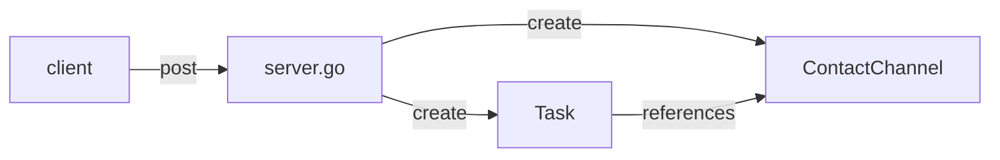
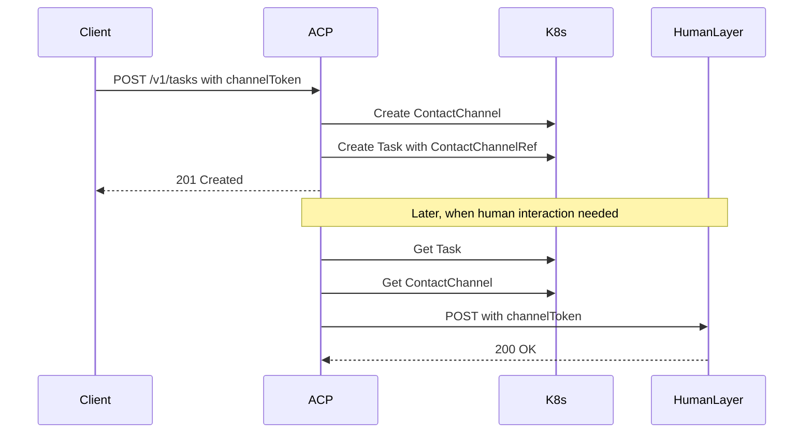

## Contact Channels with delegated tokens
Date: 2025-05-19

<!-- toc -->
- [Summary](#summary)
- [Motivation](#motivation)
  - [Goals](#goals)
  - [Non-Goals](#non-goals)
- [Proposal](#proposal)
<!-- /toc -->

## Notes

I'll refer in a few places to the "humanlayer API", but the integrating party here can be any
Agent-to-Human (A2H) compatible API, supporting FunctionCall and HumanContact resources.

## Summary

Update the existing server.go endpoints to support delegated tokens via contact channels.

In short, today a client can POST

Example:
```json
{
    "namespace": "default",
    "agentName": "my-agent",
    "userMessage": "Hello, how can you help me today?",
    "responseURL": "https://api.example.com/a2h/v1/human_contacts?response_token=...."
}
```

This results in a task being created in the  namespace with 

```
# ...
spec:
  responseURL: https://api.example.com/a2h/v1/human_contacts?response_token=....
  # ...
```

And the responseURL is expected to accept a HumanContact resource via POST on the return payload


### alternative approach

Instead, accept a `channelToken` in the request body

```json
{
    "namespace": "default",
    "agentName": "my-agent",
    "userMessage": "Hello, how can you help me today?",
    "channelToken": "...."
}
```


this results in two objects being created:

1. a ContactChannel resource
2. a Task resource with a pointer to the contactChannel

```
kind: ContactChannel
metadata:
  name: my-agent-contact-channel
spec:
  channelToken: "...."
  # no slack, email, etc details here, just the token
---
kind: Task
spec:
  contactChannel:
    name: my-agent-contact-channel
    namespace: default
  # ...
```



(recall that in general, contactChannel requires a humanlayerAPIKey - in this case the response token is used for auth instead)

From here, any invocations of A2H protocol (request approval, request response) will use the contactChannel attached to the task.

Where processing humanApprovalFlow in ToolController, check the task for a contactChannel. If the contactChannel has a response_token, use that. If not, use the humanlayerAPIKey.


## Motivation

The current state feels like a weird abstraction, since in order to create e.g. a POST /function_calls request,

the client needs to either strip the reponse_token off the URL and use it to build a new URL, 
or worse use string substitution on responseURL...


### Goals

- Leverage more existing A2H concepts and architecture like ContactChannel
- Leverage existing ACP/A2H integrations without special code for ACP tasks triggered by outside systems


### Non-Goals


## Proposal

### Extend ContactChannel CRD to support response_token

Add a new field to the ContactChannel CRD:

```go
// ContactChannelSpec defines the desired state of ContactChannel.
type ContactChannelSpec struct {
    // Type is the type of channel (e.g. "slack", "email")
    // +kubebuilder:validation:Required
    // +kubebuilder:validation:Enum=slack;email
    Type ContactChannelType `json:"type"`

    // APIKeyFrom references the secret containing the API key or token
    // +kubebuilder:validation:Required
    APIKeyFrom APIKeySource `json:"apiKeyFrom"`

    // ChannelToken is used for delegated token authentication
    // When set, this token is used instead of the APIKeyFrom for authentication
    // +optional
    ChannelToken string `json:"channelToken,omitempty"`

    // Slack holds configuration specific to Slack channels
    // +optional
    Slack *SlackChannelConfig `json:"slack,omitempty"`

    // Email holds configuration specific to Email channels
    // +optional
    Email *EmailChannelConfig `json:"email,omitempty"`
}
```

### Update Task CRD to reference ContactChannel

Add a new field to the Task CRD to reference the ContactChannel:

```go
// TaskSpec defines the desired state of Task
type TaskSpec struct {
    // AgentRef references the agent that will execute this Task.
    // +kubebuilder:validation:Required
    AgentRef LocalObjectReference `json:"agentRef"`

    // UserMessage is the message to send to the agent.
    // If provided, userMessage will be used and contextWindow must be empty.
    // +optional
    UserMessage string `json:"userMessage,omitempty"`

    // ContextWindow provides the initial conversation context when creating a Task.
    // If provided, contextWindow will be used and userMessage must be empty.
    // +optional
    ContextWindow []Message `json:"contextWindow,omitempty"`

    // ContactChannelRef references the ContactChannel to use for human interactions
    // +optional
    ContactChannelRef *LocalObjectReference `json:"contactChannelRef,omitempty"`

    // ResponseURL is deprecated in favor of ContactChannelRef
    // +optional
    ResponseURL string `json:"responseURL,omitempty"`
}
```

### Update server.go to handle channelToken

Modify the CreateTaskRequest struct and createTask handler:

```diff
// CreateTaskRequest defines the structure of the request body for creating a task
type CreateTaskRequest struct {
+    ChannelToken  string        `json:"channelToken,omitempty"`  // Optional, used to create ContactChannel
-    ResponseURL   string        `json:"responseURL,omitempty"`   // Deprecated
}

```go
func (s *APIServer) createTask(c *gin.Context) {
    // ... existing validation code ...

    // If channelToken is provided, create a ContactChannel first
    var contactChannelRef *acp.LocalObjectReference
    if req.ChannelToken != "" {
        channelName := fmt.Sprintf("%s-channel-%s", req.AgentName, uuid.New().String()[:8])
        contactChannel := &acp.ContactChannel{
            ObjectMeta: metav1.ObjectMeta{
                Name:      channelName,
                Namespace: namespace,
                Labels: map[string]string{
                    "acp.humanlayer.dev/agent": req.AgentName,
                },
            },
            Spec: acp.ContactChannelSpec{
                ChannelToken: req.ChannelToken,
            },
        }

        if err := s.client.Create(ctx, contactChannel); err != nil {
            logger.Error(err, "Failed to create contact channel")
            c.JSON(http.StatusInternalServerError, gin.H{"error": "Failed to create contact channel: " + err.Error()})
            return
        }

        contactChannelRef = &acp.LocalObjectReference{
            Name: channelName,
        }
    }

    // Create task with ContactChannel reference
    task := &acp.Task{
        ObjectMeta: metav1.ObjectMeta{
            Name:      taskName,
            Namespace: namespace,
            Labels: map[string]string{
                "acp.humanlayer.dev/agent": req.AgentName,
            },
        },
        Spec: acp.TaskSpec{
            AgentRef: acp.LocalObjectReference{
                Name: req.AgentName,
            },
            UserMessage:      req.UserMessage,
            ContextWindow:    req.ContextWindow,
            ContactChannelRef: contactChannelRef,
            ResponseURL:      req.ResponseURL, // For backward compatibility
        },
    }

    // ... rest of createTask implementation ...
}
```

### Update ToolCall Controller

Modify the ToolCall controller to handle the new ContactChannel reference:

```go
func (r *ToolCallReconciler) getContactChannel(ctx context.Context, tc *acp.ToolCall) (*acp.ContactChannel, error) {
    // First check if the task has a ContactChannel reference
    var task acp.Task
    if err := r.Get(ctx, client.ObjectKey{
        Namespace: tc.Namespace,
        Name:      tc.Spec.TaskRef.Name,
    }, &task); err != nil {
        return nil, fmt.Errorf("failed to get task: %v", err)
    }

    // If task has ContactChannelRef, use that
    if task.Spec.ContactChannelRef != nil {
        var contactChannel acp.ContactChannel
        if err := r.Get(ctx, client.ObjectKey{
            Namespace: tc.Namespace,
            Name:      task.Spec.ContactChannelRef.Name,
        }, &contactChannel); err != nil {
            return nil, fmt.Errorf("failed to get contact channel: %v", err)
        }
        return &contactChannel, nil
    }

    // Fall back to MCP server's approval contact channel
    // ... existing MCP server contact channel logic ...
}
```

### Authentication Flow



### Migration Strategy

1. Add new fields to CRDs while keeping old fields for backward compatibility
2. Update server.go to handle both channelToken and responseURL
3. Update controllers to check ContactChannelRef first, then fall back to responseURL
4. Add deprecation notices to responseURL fields
5. Plan for removal of responseURL in a future version

### Security Considerations

1. ChannelToken should be treated as sensitive data, consider storing as a secret with a secretKeyRef


